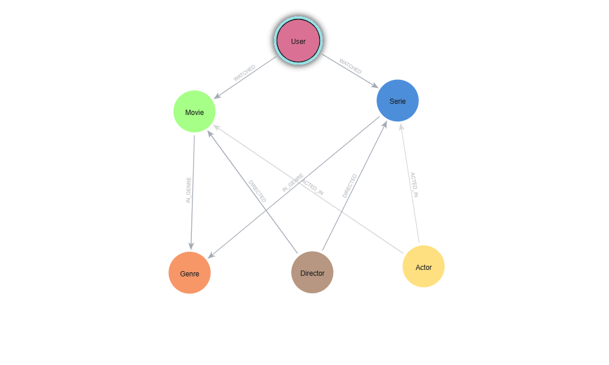

# 🎬 neo4j-movie-project-

Projeto de modelagem de dados em grafos utilizando **Neo4j Aura** para simular uma plataforma de streaming.
O sistema representa usuários, conteúdos (filmes e séries), diretores, atores e gêneros, permitindo mapear interações de consumo e avaliação.

Este projeto foi desenvolvido como parte de um desafio prático da **DIO (Digital Innovation One)**.

---

## 📐 Modelo do Grafo

O esquema abaixo demonstra a arquitetura de dados gerada através do comando `CALL db.schema.visualization()` no ambiente do Neo4j Aura:

---

## 💾 Código do Projeto

Todo o script de criação dos nós (Users, Movies, Series, Genres, Actors, Directors) e dos relacionamentos está salvo no arquivo `script.cypher` neste repositório.

---

## 🛠️ Desafios Encontrados & Aprendizados;
Durante o desenvolvimento deste desafio, foram encontrados e solucionados os seguites obstáculos:

  1. **Escopo de Variáveis ao Criar Relacionamentos (Relações Isoladas):**
   * *Problema:* Ao tentar executar o bloco de relacionamentos `WATCHED` separadamente do restante do código, o Neo4j não conectava os nós corretamente. 
   Isso acontecia porque as variáveis dos usuários e conteúdos (como `u1`, `m1`) perdiam a referência quando executadas de forma isolada.
   * *Solução:* A solução foi unificar todo o script (criação de nós e criação de relacionamentos) em um único bloco de execução. Dessa forma, o Neo4j mantém o escopo das variáveis ativo do início ao fim, garantindo que o usuário correto se conecte ao filme ou série correspondente.

2. **Sentido Semântico dos Relacionamentos (Gênero vs. Conteúdo):**
   * *Problema:* Inicialmente, associei a lógica pensando que "o gênero pertence ao filme". Contudo, na modelagem de grafos, a semântica precisa ser natural à leitura humana.
   * *Solução:* Ajustei a direção das setas e o modelo para que o **Filme/Série estivesse contido em um Gênero** (`(:Movie)-[:IN_GENRE]->(:Genre)`), tornando as consultas de filtragem por categoria muito mais intuitivas e performáticas.
   * *Solução:* Ajustei a direção das setas e o modelo para que o **Filme/Série estivesse contido em um Gênero** (`(:Movie)-[:IN_GENRE]->(:Genre)`), tornando as consultas de filtragem por categoria muito mais intuitivas e performáticas.
